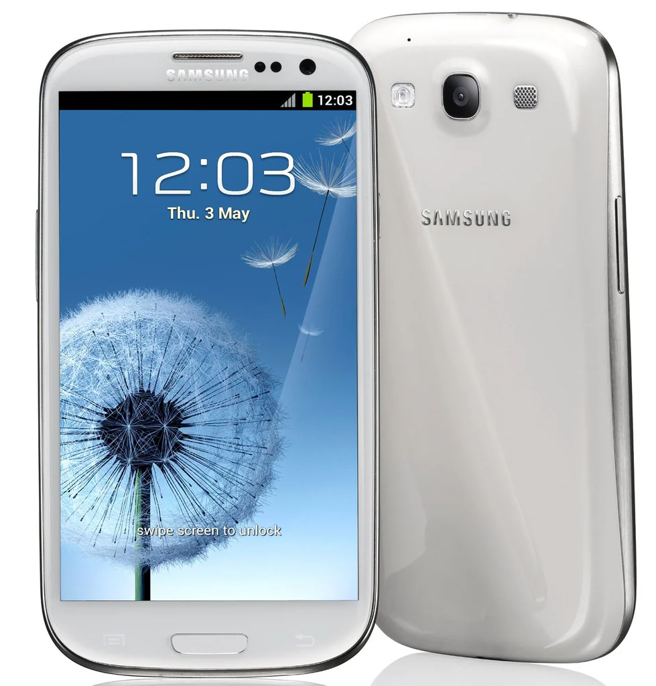

Copyright 2012 - The CyanogenMod Project

Copyright 2017 - The LineageOS Project

Device configuration for Galaxy S3 (Qualcomm Variants)
=====================================

|Basic						| Spec Sheet
|---------------------------|:------------------------------------------------------------------|
|CPU						| Dual-Core 1.5 GHz Krait											|
|CHIPSET					| Qualcomm MSM8960 Snapdragon										|
|GPU						| Adreno 225														|
|Memory 					| 2GB RAM															|
|Shipped Android Version	| 4.4.2																|
|Storage					| 16/32GB															|
|MicroSD					| Up to 64GB (Manufacturer's specs,	but is capable of up to 128GB)	|
|Battery					| 2100 mAh															|
|Dimensions					| 136.6 x 70.6 x 8.6 mm												|
|Display					| 720 x 1080 pixels, Super AMOLED									|
|Camera						| 8 MP, 3264 x 2448 pixels											|
|Release Date				| July 2012															|

